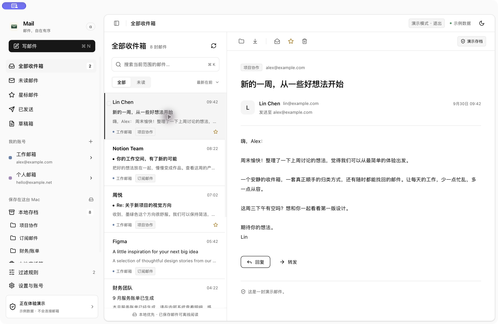

# 雁信 Yanxin

面向 Mac 的多账号邮件客户端。React + shadcn/ui + Tauri 2 + Rust；发布流水线构建 Apple Silicon 与 Intel 两种架构。

“雁信”取意鸿雁传书。窗口标题、菜单栏提示、界面及应用包统一使用“雁信”，开发项目名称为 `yanxin`。

macOS 开发预览通过临时的“雁信.app”启动，Dock 名称使用中文；`Info.plist` 明确设置中文显示名。临时应用包位于 Cargo 输出目录，无需安装，继续支持热更新。

**当前版本：0.1.2 Alpha。** 已有可运行的桌面应用与协议实现，腾讯企业邮已实际收取并保存邮件；尚未完成 PRD 全部 P0 验收，以及各服务商真实账号的完整收发联调。

## 界面

按用户指定的 [shadcn dashboard-01](https://ui.shadcn.com/view/new-york-v4/dashboard-01) 调整：中性色、可收起侧栏、内嵌圆角内容区、卡片和紧凑导航。使用官方 Sidebar 和 Card 组件，邮件采用三栏布局，操作按钮位于发件人信息右侧，邮件信息固定、正文独立滚动。应用图标暂定米白底绿色信封 v3。



上图为早期演示界面，当前布局及功能以运行版本和实施状态为准。

## 运行

需要 Node.js 22.15 或更新版本、Rust stable、Xcode Command Line Tools；本轮在 arm64 macOS 上验证。

```sh
npm ci
npm run desktop
```

`npm run desktop` 会启动 Vite 并直接打开 macOS 开发版，支持真实邮箱与本地存档，无需打包或安装。保持命令运行，前端修改自动刷新，Rust 修改自动重新编译并启动；按 Ctrl+C 停止。日常界面调整和联调使用此命令，交付应用时再运行 `npm run desktop:build`。

开发启动器使用 execve 交接进程，Rust 重新构建会结束旧实例，不会累积 Dock 图标。应用采用单实例保护，再次启动只打开已有窗口。

macOS 开发启动器在启动前用本机唯一有效的 Apple Development 证书签名，固定使用 `dev.maildesk.desktop` 应用标识，避免临时签名随重建变化而反复请求钥匙串授权。切换签名后的首次读取现有凭据可能仍需在系统提示中选择“始终允许”；系统钥匙串被锁定或更换签名证书时仍可能要求授权。已有账号、钥匙串服务名及本地存档保持不变。

若本机没有开发证书，在 Xcode 的账号管理中创建 Apple Development 证书；若有多个证书，通过 `YANXIN_DEV_SIGNING_IDENTITY` 指定有效证书的完整名称或 SHA-1，例如 `YANXIN_DEV_SIGNING_IDENTITY='<证书 SHA-1>' npm run desktop`。签名失败会停止启动，不会退回临时签名。`npm run test:desktop` 验证签名选择与失败处理。此处仅为本机开发签名，正式分发的 Developer ID 签名与公证仍待配置。

只预览界面：`npm run dev`，访问 `http://127.0.0.1:1420`。浏览器不支持真实邮件收发，点击“先体验一下”加载演示账号和示例邮件。

```sh
npm test
npm run test:rust
npm run desktop:build
```

桌面产物：`src-tauri/target/release/bundle/macos/雁信.app` 及带更新签名的 `.app.tar.gz`/`.sig`。本机发布脚本从仓库外读取匹配的更新密钥，密钥缺失或不匹配会停止构建。Developer ID 分发签名及公证尚未配置。

## 发布与更新

GitHub Actions 执行回归，分别构建 Apple Silicon/Intel DMG 与签名更新包，汇总完整文件后创建草稿 Release。正式应用启动后和每 6 小时检查 GitHub Release；有更新才在“本地优先”前显示图标，支持下载进度、签名校验、安装并重启，后续更新无需拖入 Applications。设置页可手动检查。

密钥、版本、首次安装和发布步骤见 [发布与应用内更新](docs/UPDATES.md)。开发预览可以检查更新，下载安装仅在正式应用中进行。首次上线与真实升级的验收记录见 [继续检查点](docs/DEVELOPMENT_STATUS.md)。

## 已接入

- Gmail、Outlook、Microsoft 365、QQ、网易、腾讯/网易企业邮和自定义服务器入口。
- IMAP / POP3 收件、SMTP 发件、TLS / STARTTLS、密码/授权码、OAuth PKCE 代码路径。IMAP 支持 UIDVALIDITY 的 STATUS 兜底；完全缺失时逐封下载并按完整内容去重（每轮重下载）。
- 多账号收件箱、按标题/发件人/收件人/正文搜索、未读/星标/附件组合筛选、阅读、附件保存与 EML 导出；账号收取异常图标悬停或键盘聚焦可查看具体原因。
- 纯文本、富文本、Markdown 和 HTML 源码写信；支持导入 `.md` / `.html` 正文文件、效果预览、附件与 CC/BCC、草稿自动保存、回复/全部回复/转发。写信窗口默认放大，可最大化和还原。回复尊重 Reply-To，全部回复去重并排除已配置的本人地址；回复写入标准 In-Reply-To / References 引用头，转发附件仍需手动添加。
- 单封独立邮件使用普通阅读面板；存在回复引用关系时展示对话：来信靠左、自己的邮件靠右，时间从旧到新；底部快速回复、草稿保存与完整编辑。按回复引用链聚合，不按相同标题猜测；不同账号分开。
- 正文工具栏支持当前已加载列表中的上一封/下一封，快捷键为 ⌥↑/⌥↓。未读邮件打开后移出列表，也可继续阅读下一封；输入和弹窗不会被导航快捷键打断。当前边界不会自动加载更多结果。
- 添加或编辑账号时可切换“收到的邮件保存在本地”，默认开启。关闭后只保存列表元数据，打开正文时从服务器读取，不持久保存收到的正文或附件；已有完整存档保留，重新开启后逐封补存。应用自己发送且 SMTP 已确认的邮件仍保存本地副本，供发送恢复和往来记录使用。
- 点击账号旁的箭头展开服务器文件夹，按服务器返回的分隔符显示父子目录，子目录只显示自身名称；点击可信文件夹显示该文件夹邮件并补收；已隔离目录显示原因，不自动补收。支持 IMAP 中文文件夹；POP3 只有收件箱。用户已读/星标及撤销已接入持久出站同步队列；每轮批量回读服务器标记，已缓存正文不重复下载，保护未完成的本地意图与规则标记。设置页可查看任务与失败原因并重试。服务器单封 MOVE 已实现；映射目录的归档/垃圾邮件/服务器废纸篓快捷入口已实现，永久删除尚未实现；其他客户端改标记的真实端到端验收仍待补充。异常根目录有持久来源隔离与独立只读核查：设置 → 目录来源检查可查看原因和旧来源数量。隔离不会删除元数据、MIME 或附件；仅依赖异常来源的在线条目暂停展示，完整本地存档保留。核查成功后仍须完整收取重新核对，才能恢复旧来源。腾讯/QQ旧在线来源准确归属及根目录写入兼容仍待解决，不能把收件箱成功等同于全目录成功。
- 本地通讯录、从邮件创建联系人、收件人地址自动补全；常用地址同时来自已保存邮件。
- 编辑账号名称、收发服务器及认证配置；收、发连接验证成功后保存，邮箱身份保持不变，已有邮件与本地操作状态保留。
- 兼容声明 GBK/GB18030 等字符集的旧式原始邮件头；保留 HTML 邮件的排版样式，列表摘要不包含样式代码。已有存档在启动时从本地原件更新显示信息。
- 邮件时间使用原始 Date，缺失或无效时依次尝试 Received 和 IMAP INTERNALDATE，不使用下载时间。旧存档自动修复显示日期；没有可用日期显示“时间未知”，待服务器连接成功后补充。
- 大邮箱列表只传送元数据和当前分页，会话关系按索引版本缓存；正文按需读取，后台收取合并界面刷新，避免反复加载整个邮箱正文。
- 可配置规则：账号范围、多条件 AND / OR、优先级、命中后停止、预览、对历史邮件执行；归类、已读、星标和废纸篓动作只作用于本地。
- 完整原始 MIME 邮件独立留存；存档以 SHA-256 命名，读取时校验，先持久化再归类。服务端清理或移除账号不会删除已完整下载的原始邮件。
- SQLite 索引、存档备份/恢复、macOS 钥匙串保存凭据、菜单栏入口；支持 IMAP IDLE 实时监听收件箱，收到通知后立即排队收取该账号的收件箱，各账号独立执行，遵循账号的本地留存设置。手动收取优先检查各收件箱；选中服务器文件夹时刷新该文件夹，同一文件夹的任务按顺序执行。历史文件夹同步不会占住其他文件夹或账号的收件箱。后台补查可设为 1/5/10/15/30/60 分钟，覆盖 POP3、不支持 IDLE 的服务器及其他文件夹。断线自动重连，暂停/移除/编辑账号后更新监听；检测到睡眠间隔后重新连接并补收，真实睡眠唤醒仍待验收。
- 批量校验本地原始 MIME 的哈希与附件解码，列出缺失或损坏的存档；不会修改或删除原件。
- 设置中可按账号或全部删除本地存档，确认前显示数量、大小及仅有本地来源的邮件数量。保留可在线读取的列表索引，移除仅本地记录；可同时关闭后续自动保存。共享原件仍被其他账号使用时保留；失败或中断时恢复仍被索引引用的文件。发送记录、草稿、已导出备份和独立下载文件不在此清理范围。
- 发送记录显示 SMTP 确认、服务器拒绝和结果未确认；支持手动准备重发草稿及恢复已发送邮件的本地副本。
- 系统通知：新邮件和发送结果分别开关，普通发送、快速回复和定时发送覆盖成功/失败/结果未确认；首次导入和 24 小时前的历史邮件不通知。设置提供测试通知按钮；macOS 通知权限、专注模式和横幅由系统控制。
- 开机自启：正式应用可通过设置注册 macOS LaunchAgent，登录后后台启动；开发预览依赖 Vite，禁用开启入口以免登录后空白窗口，允许关闭已有启动项。
- 本机定时发送：计划持久保存，正文和附件在安排时固定；可修改时间、取消并恢复草稿。结果不明时不自动重发。
- HTML 邮件直接显示外部图片，旧 HTTP 图片及字体资源升级为 HTTPS；资源服务器已删除或拒绝访问的内容无法加载。网页链接在系统浏览器打开，mailto 链接进入本应用写信窗口；清洗脚本和表单，正文沙箱禁止脚本运行。阅读区采用紧凑地址、标题布局，回复与转发位于顶部，列表及阅读时间显示完整年月日与时分秒；附件卡片显示文件名、大小和下载图标，随栏宽排列。

## 写信与定时发送

正文格式菜单支持纯文本、富文本、Markdown 和 HTML 源码。Markdown 会转换为 HTML 邮件，支持标题、列表、表格和代码块；HTML 可直接粘贴完整文档或片段，或点击“导入文件”。两种源码模式都有预览，草稿保留原始源码；发送时附带可读的纯文本备用正文。HTML 保留内嵌样式和表格，脚本及表单会被清理；正文文件导入上限 10 MB。

回复默认不包含原文，转发默认包含原文；可用“包含原文”开关调整。原文在编辑区域下方独立渲染，保留 HTML 样式、表格及图片，不进入富文本编辑器。点击“发送预览”查看新写内容与原文合并后的正文。发送时内嵌图片生成 MIME inline 附件，草稿和取消定时计划保留原文及开关状态；不同收件客户端可能调整 HTML 展示。

点击“定时发送”，选择本机时区的日期与时间并确认；在“发送记录”中修改时间或取消计划。取消后正文及附件恢复成新草稿，已有计划记录保留。

定时发送由本机后台执行，**需要应用运行、Mac 醒着且能连接 SMTP**；关闭窗口仍可执行，完全退出或睡眠时无法发送。错过不超过 5 分钟的计划可在恢复运行后执行，超过 5 分钟标记为“已错过时间”，需重新安排。账号暂停/移除、认证失败、服务器拒绝或结果不明均保留记录；不会反复自动重试。发送使用独立任务锁，不再等待整轮邮件收取；普通发送与定时发送仍按顺序执行，防止重复投递。发送计划暂不包含在存档备份中，也没有云端定时服务。

## 连接真实邮箱前

QQ、网易等通常需在邮箱官网启用 IMAP/POP3/SMTP 并获取授权码。企业服务器配置及权限取决于管理员；这些预设尚未逐服务商联调。

Gmail / Microsoft 的 OAuth 需要注册属于本产品的应用。可以在账号高级设置填写 Client ID，或构建前设置 `MAIL_GOOGLE_CLIENT_ID`、`MAIL_MICROSOFT_CLIENT_ID`；Google 桌面应用如需 client secret，可设置 `MAIL_GOOGLE_CLIENT_SECRET`。不要提交实际凭据。原生应用中的 client secret 不是可保密的服务端秘密。

代码使用系统浏览器、PKCE 和本机临时端口回调；Google 应配置桌面客户端，Microsoft 应配置公共原生客户端与 localhost 重定向及邮件委托权限。OAuth 应用发布审核、租户策略和真实授权仍需验证。参考 [Google 原生应用 OAuth](https://developers.google.com/identity/protocols/oauth2/native-app)、[Microsoft 邮件协议 OAuth](https://learn.microsoft.com/en-us/exchange/client-developer/legacy-protocols/how-to-authenticate-an-imap-pop-smtp-application-by-using-oauth)。

## 数据与行为

- 默认数据目录由 Tauri `app_data_dir` 决定，macOS 通常为 `~/Library/Application Support/dev.maildesk.desktop/`；应用设置页显示实际位置。
- `archive/*.eml` 保存已完整留存的原始 MIME，SQLite 保存列表索引和本地操作状态；在线阅读账号不写入收到的 MIME 文件，元数据仍在本机。文件本身尚未做应用层加密。
- 只修改账号名称或本地留存开关时直接“保存设置”，无需等待收取结束或重新验证服务器。后台收取读取最新留存设置，同步结束不会覆盖开关；已有完整存档保留。修改服务器或凭据仍需验证。
- 关闭窗口保留后台运行；点击菜单栏图标直接显示并聚焦主窗口，不弹出二级菜单。关闭窗口后点击 Dock 图标也会重新显示，最小化的窗口会恢复。退出使用应用菜单或 ⌘Q。退出 App、Mac 睡眠或断网时不能继续下载。**必须在服务端删除前完成下载**，才能保留本地副本。
- 主窗口记忆尺寸、位置与最大化状态，关闭时保存，启动时恢复；不持久化隐藏、最小化或 macOS 原生全屏状态。服务器文件夹使用普通/扩展 LIST 特殊用途标记或常见精确名称显示中文标签与图标，实际服务器路径保持原样；设置中的账号操作支持自定义特殊文件夹映射与恢复自动识别。
- 备份包含邮件、存档元数据、规则和本地联系人，不包含凭据、账号、草稿、待发队列或服务端操作队列。恢复时合并缺失的规则和联系人，保留已有同 ID 的规则及同邮箱的联系人；不恢复服务端文件夹关系。兼容没有联系人表的旧备份。
- 发送前在界面等待 8 秒，可取消；进入 SMTP 阶段后不能撤回。失败不自动重发。应用中断时未完成的发送记录转为“结果未确认”；准备重发必须先确认重复发送风险，只创建草稿，仍需手动点击发送。
- IMAP 阅读工具栏的复制/移动使用 shadcn 下拉菜单：来源自动固定，选择目标即记录任务。移动菜单提供归档、垃圾邮件、服务器废纸篓快捷项，缺失或冲突的映射显示禁用说明；All 不视为归档。设置页“服务器文件夹操作”显示持久任务；提交前检查 UIDPLUS/IMAP4rev2，保存 COPYUID 并核对目标全文后才标记完成。已提交但确认丢失不自动重发；已保存回执的原生 COPY/MOVE 失败任务仅重试只读核对。COPY 保留原邮件；原生 MOVE 要求服务器能力及可靠的来源 UIDVALIDITY，核对目标全文和原编号已移除后才更新来源，本地完整存档保留。移动中的已读/星标修改会提示等待；未完成标记任务需先处理。MOVE 即使返回拒绝也可能部分成功，无可靠回执时不重发：先刷新目标目录，在设置中点击“只读核对”，仅唯一可信目标、全文匹配及原编号消失都通过才完成。目标有多个匹配副本或命名空间变化继续保留未确认；不执行普通 EXPUNGE/CLOSE。服务器无 MOVE 但有 UIDPLUS 时，分阶段复制并保存回执、核验目标和来源全文，然后只标记/移除精确 UID。移除中断后只读核对，主动选择“继续移除原目录”会重新核验两个副本，不会再次复制。无 UIDPLUS 时拒绝提交。永久删除尚未实现。
- 当前没有云端处理、遥测或自动上传。用户已允许后续设计云端能力。

## 下一阶段

详见 [开发进度与继续检查点](docs/DEVELOPMENT_STATUS.md)、[实施记录](docs/IMPLEMENTATION.md) 和 [PRD](PRD.md)。主要待完成：长期收取稳定性与其他真实邮箱联调、服务端状态回读的真实端到端验收、无 MOVE 服务商真实验收、复杂冲突处理与旧异常来源恢复、服务端已发送上传、规则服务端动作、存档范围/保存任务状态、全文索引与五万封验收、可切换逐封列表、转发/拖拽附件，以及签名公证与更新。QQ 已知历史收取故障、基础特殊目录角色、扩展发现及用户自定义映射、主窗口状态记忆、连续阅读与快捷键、已知原生弹窗迁移至 shadcn、用户已读/星标出站持久队列、批量状态回读、异常目录隔离及独立只读核查、服务器 COPY/MOVE 持久任务及结果核对、移动未知结果只读恢复、目标目录直接选择、映射目录快捷操作及有 UIDPLUS 的无 MOVE 兼容已完成；附件预览、目录树、栏宽记忆、通知、自启及本机定时发送已有实现，真实环境验收仍有缺项。

本机 macOS 工具链存在符号裁剪导致 Mach-O 错误的问题，release 配置关闭 strip；见 [Rust upstream issue](https://github.com/rust-lang/rust/issues/157750)。`imap-proto 0.10.2` 有未来 Rust 兼容性警告，后续应更换或升级协议库。


### 界面操作

- 拖动左侧菜单与工作区、邮件列表与正文之间的分隔线调整宽度；宽度会在本机记住。分隔线支持键盘方向键，阅读最大化/还原保留原布局。
- 全局关闭系统右键菜单；业务右键操作可使用已接入的 shadcn Context Menu 组件。
- 下拉操作菜单与表单选择框统一使用 shadcn 组件，邮件加载使用骨架屏。

## UI 组件规则

所有界面组件统一使用 **shadcn/ui**。新增功能通过组合官方组件完成，不再自行实现基础控件；具体要求见 [AGENTS.md](AGENTS.md)。定时发送使用中文 Calendar + Popover 日历和 Select 小时/分钟选择，写信和发送记录的修改时间共用同一个选择器。自动补全使用 Command + Popover，已读/未读切换使用 Tabs，账号勾选使用 Checkbox。

`npm run check:ui` 检查业务代码中的原生控件、自绘按钮入口和原生日期/时间选择器，`npm run build` 会先执行该检查。`src/components/ui/` 保留官方组件源码及必要适配。

### 编码异常与发送回执

部分历史邮件的 MIME Base64 内容可能不规范。兼容 URL-safe 字母和缺失填充，但不删除任意非法字符；无法解码的正文片段、内嵌图片或附件单独标记，继续收取其他邮件。本地留存账号保留完整原始 MIME，异常附件禁止下载伪造或空文件；存档校验仍报告这些异常。

发送记录区分“发送成功 · SMTP 已确认”“发送失败”和“结果未确认”。成功表示发送服务器已接受，不证明最终送达或对方已读；断线而未获确认时不自动重发。此版本不请求阅读回执。

### 附件预览

点击附件名称或文件图标，雁信会将附件解码到应用专用缓存，并调用 macOS 默认应用打开，无需选择下载位置。右侧下载图标用于另存附件。普通单封与回复对话均支持，打开过程中显示加载状态并防止重复点击。

预览缓存与原始邮件存档独立，按邮件内容和 MIME 片段隔离；7 天未使用的缓存会在下次预览时清理。关闭账号的本地留存后，预览仍需临时取回附件，但不会因此将邮件加入本地存档。附件损坏会显示错误；程序或脚本不直接启动，可自行另存。
