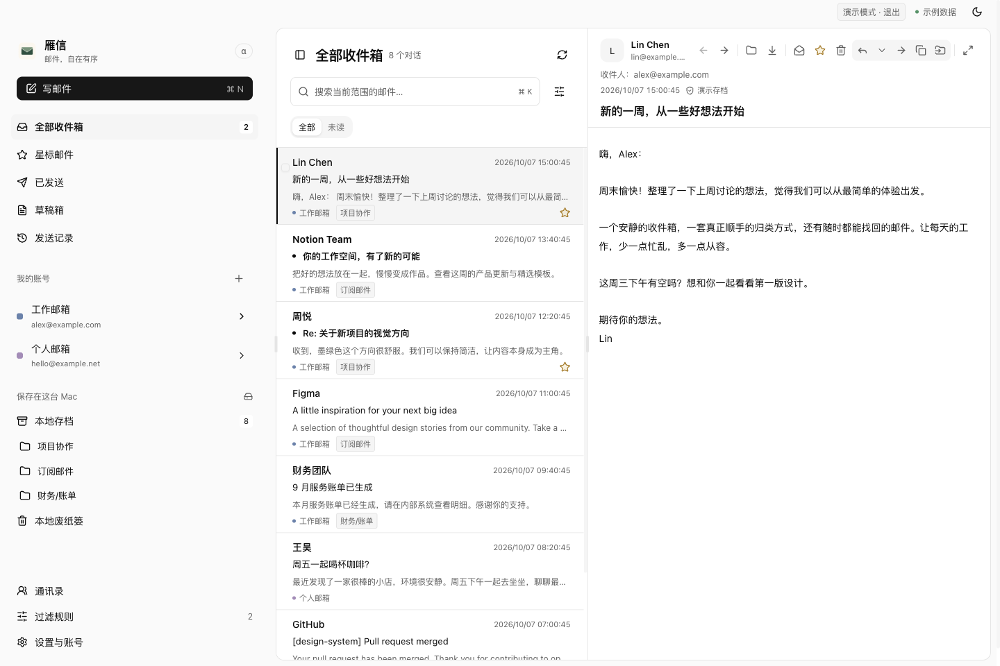
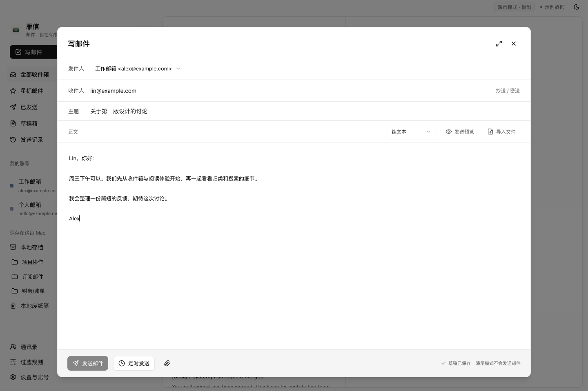
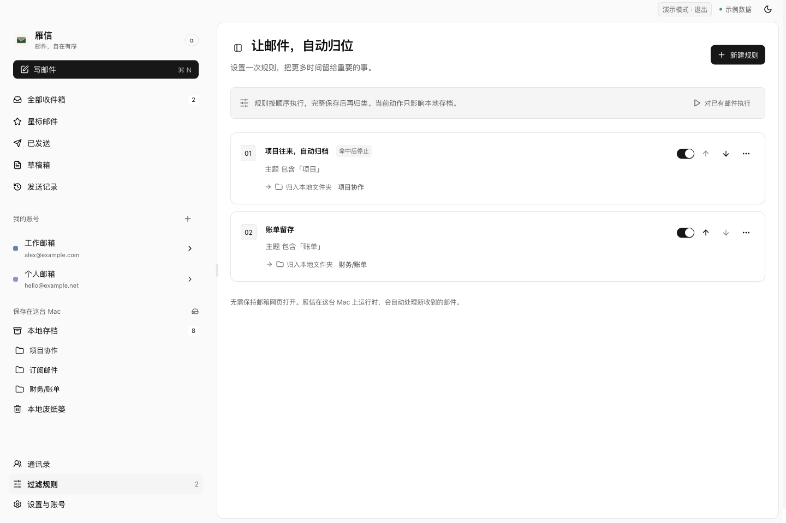

# Anser（雁信）

**邮件，自在有序。**

雁信是一款面向 macOS 的多账号邮件客户端。它将不同邮箱的邮件集中呈现，提供清晰的阅读与回复体验，并支持将完整邮件和附件独立保存在本机。

网页预览与桌面共用界面，相关代码推送到 `main` 后自动部署；只展示虚构邮箱，不能实际连接或收发邮件。

[下载最新版本](https://github.com/ansermail/anser/releases/latest) · [界面预览](https://ansermail.github.io/anser/) · [使用说明](docs/USAGE.md) · [开发进度](docs/DEVELOPMENT_STATUS.md) · [反馈问题](https://github.com/ansermail/anser/issues)

> 当前版本为 **0.1.9 Alpha**，支持 Apple Silicon 与 Intel Mac。核心功能已实现，长期稳定性、部分服务商兼容性及完整发布验收仍在持续完善。



_所有展示截图均来自浏览器演示模式，使用项目内置的虚构账号和示例邮件，不包含真实邮箱信息。_

[在线界面预览](https://ansermail.github.io/anser/)使用虚构邮件，可阅读、搜索、切换主题和调整分栏；不连接真实邮箱、不保存邮件或发送消息。正式桌面包隐藏示例邮箱入口。

0.1.6 已包含按账号设置的邮件签名、可选择的存档保存位置、EML 文件查看和设置页整理，并保留“按对话 / 逐封邮件”切换、连续阅读及服务器已发送副本核对。具体完成项与待办见[开发进度](docs/DEVELOPMENT_STATUS.md)。

0.1.9 已由 GitHub 双架构构建并发布，改善实时连接补查与 QQ 已发送副本核对，修复跨时区邮件排序和长标题未读标识，并接入 Microsoft 桌面登录配置。完整本地保存、规则、服务器数量/磁盘预算及 Finder 打开 EML 保留。全文搜索与规模优化继续开发；真实繁忙收件、部分服务商兼容性和正式升级仍在验收。

## 主要功能

| 功能       | 说明                                                                                                    |
| ---------- | ------------------------------------------------------------------------------------------------------- |
| 多账号管理 | 统一收件箱、账号独立视图与服务器文件夹树，支持自定义收发服务器。                                        |
| 邮件收取   | IMAP / POP3 收件、SMTP 发件；IMAP IDLE 监听收件箱，定时补查作为补充。                                   |
| 阅读与对话 | 单封邮件独立阅读，有回复引用关系的邮件按往来对话展示；支持搜索、未读、星标及附件筛选。                  |
| 写信与回复 | 纯文本、富文本、Markdown 与 HTML 正文，草稿自动保存、回复、全部回复、转发及发送预览。                   |
| 附件处理   | 调用 macOS 默认应用预览附件，也可另存到指定位置。                                                       |
| 本地留存   | 按账号选择完整存档或在线阅读；完整原始邮件独立保存，支持备份、恢复与完整性校验。                        |
| 自动归类   | 按账号与多条件配置规则，支持优先级、命中后停止及历史邮件处理。支持本地归类及明确的服务器复制/移动动作。 |
| 桌面集成   | 新邮件与发送结果通知、菜单栏入口、登录自启、本机定时发送及应用内更新。                                  |

### 写信

在同一编辑窗口中管理收件人、正文格式、附件与发送时间。回复默认不附原文，转发默认附原文，也可手动调整；发送预览用于检查最终正文。



### 过滤规则

为项目往来、账单或订阅邮件设置归类条件，减少重复整理。规则支持先预览，再对历史邮件执行。



## 使用许可

**个人自用免费，包含处理自己的工作邮件；企业统一部署、商业集成或销售需另行授权。**

项目源码公开，采用 [Anser Personal Use License](LICENSE)，不是允许不受限商业使用的 MIT/Apache/GPL 许可。[使用边界与商业授权说明](docs/LICENSING.md)。第三方依赖保留原许可。

## 下载与安装

1. 前往 [GitHub Releases](https://github.com/ansermail/anser/releases/latest) 下载 DMG。
2. Apple Silicon Mac 选择文件名含 `aarch64` 的版本；Intel Mac 选择含 `x86_64` 的版本。
3. 打开 DMG，将「雁信」拖入「应用程序」，再启动应用。
4. 添加邮箱账号，按服务商要求填写密码、授权码或 OAuth 配置。

当前分发包尚未完成 Apple Developer ID 签名与公证，首次安装可能需要通过 macOS 系统设置确认打开。应用内更新包有独立签名校验，但这不等同于 Apple 公证。

### 应用内更新

正式应用启动后自动检查更新，之后每 6 小时检查一次。发现新版本时，顶部状态区域显示更新图标；也可以在「设置与账号 → 关于与更新」中手动检查。

点击更新入口即可查看发布说明、下载进度，并安装重启。后续升级在当前应用位置完成，无需再次手动拖入「应用程序」。

## 邮箱配置

提供 Gmail、Outlook、Microsoft 365、QQ、网易、腾讯企业邮、网易企业邮及自定义服务器的配置入口。**配置入口不代表所有服务商均已完成真实账号验收**；已使用腾讯企业邮箱与 QQ 邮箱开展实际收发联调，完整结果见 [开发进度](docs/DEVELOPMENT_STATUS.md)。

QQ、网易等服务通常需要先启用 IMAP / POP3 / SMTP 并获取授权码。Gmail 与 Microsoft OAuth 需要配置相应应用的 Client ID，详细步骤与限制见 [使用说明](docs/USAGE.md#连接真实邮箱前)。

## 数据与使用边界

- **本地优先**：账号凭据存入 macOS 钥匙串，列表索引与操作状态存入本地 SQLite；完整留存的邮件以原始 MIME 文件保存。当前没有云端处理、遥测或自动上传。
- **按账号留存**：关闭本地保存后，新收到的邮件只保留列表信息，正文与附件按需从服务器读取；已有完整存档保留。需要长期保存的邮件，应在服务器删除前完成下载。
- **发送状态**：「发送成功」表示 SMTP 服务器已接受邮件，不等同于最终送达或对方已读。发送结果不明时不会自动重发。
- **后台运行**：关闭窗口后应用仍可收取邮件；完全退出、Mac 睡眠或断网时不能继续收取。本机定时发送同样需要应用运行、Mac 醒着且 SMTP 可用。
- **备份范围**：存档备份包含邮件、存档元数据、规则和联系人；不包含账号凭据、草稿、待发计划及服务端操作队列。邮件文件尚未进行应用层加密。

具体行为、兼容限制与尚未完成的功能见 [使用说明](docs/USAGE.md) 和 [开发进度](docs/DEVELOPMENT_STATUS.md)。

## 本地开发

技术栈：**React 19 · TypeScript · shadcn/ui · Tauri 2 · Rust · SQLite**。

macOS 开发环境需要 Node.js 22.15 或更新版本、Rust 工具链和 Xcode Command Line Tools。CI 当前使用 Rust 1.91.1。

```sh
npm ci
npm run desktop
```

`npm run desktop` 直接运行桌面开发预览，支持真实收发与本地存档，无需重复安装。前端支持热更新，Rust 修改后自动重新编译；本机开发签名要求见 [本地开发与签名](docs/USAGE.md#本地开发与签名)。

仅体验界面：运行 `npm run dev`，访问 `http://127.0.0.1:1420`，点击「先体验一下」。浏览器演示不连接真实邮箱，也不会发送邮件。

常用检查命令：

```sh
npm test
npm run test:rust
npm run test:desktop
npm run format:check
npm run build
```

所有界面组件统一使用 shadcn/ui，开发约定见 [AGENTS.md](AGENTS.md)。发布构建、密钥配置和 GitHub Actions 流程见 [发布与应用内更新](docs/UPDATES.md)。

## 项目文档

- [功能与使用说明](docs/USAGE.md)：具体功能、数据行为及开发运行方式。
- [开发进度与继续检查点](docs/DEVELOPMENT_STATUS.md)：已完成事项、验收证据和剩余任务。
- [发布与应用内更新](docs/UPDATES.md)：构建、签名、版本发布与升级流程。
- [产品需求](PRD.md)与[实施记录](docs/IMPLEMENTATION.md)：需求范围与实现过程。
